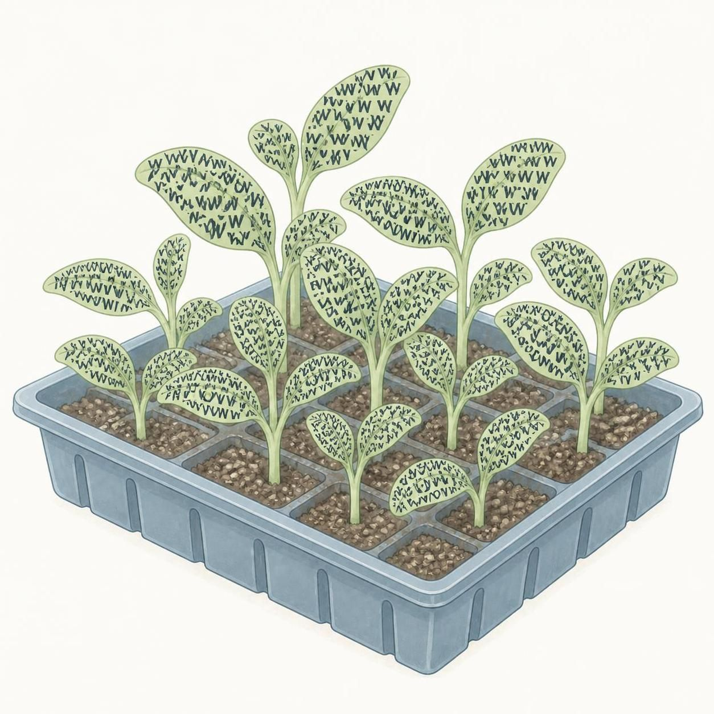

::: {.eyecatch}

:::

# okf-seedling

ドキュメントを **エージェントに読める形で整え、公開する** Quarto テンプレートツールです。

LLM やエージェントに知識を読ませたいのに、検索がズレて回答がハズレる — それは文章が悪いのではなく、**知識が「形式」に沿って整理されていない**からです。

- **Why**: 人間向けの文章のままでは、エージェントは概念の区切り・メタ情報・鮮度を正しく読めない
- **What**: OKF(Open Knowledge Format)は知識を「1 概念 1 ファイル + フロントマター」に構造化する形式
- **How**: `.qmd` を書くだけで、**人間用 HTML** と **機械用 OKF バンドル**、さらに**リンターチェック**までが同時に生まれる

```{mermaid}
flowchart LR
    Q["concepts/*.qmd<br>書く(1 概念 1 ファイル)"] --> L["quarto render"]
    L --> H["_site/<br>人間用 HTML"]
    L --> O["okf/<br>機械用 OKF バンドル"]
    O --> V["validate-okf リンター<br>準拠 + 品質警告"]
```

::: {.callout-tip}
## ブラウザで試す

ローカル環境なしで OKF 概念ファイルを編集・コミットできます。[Online Editor](editor.qmd) または [Quarto Editor PE](https://quarto-editor-pe.vercel.app/editor) を開いてください。
:::

- エージェントにも人間にも読める `.qmd` をソースに
- `quarto use template` 一発でバンドル雛形を生成
- レンダリングで **人間用HTML** と **機械用OKFバンドル** を二系統出力
- **リンターツール**として準拠チェック + 鮮度・欠落の品質警告
- GitHub Pages / Cloudflare Pages に並行デプロイ

## OKF バンドルとは

エージェントにも人間にも読める形で、ドキュメント群をひとまとめにした知識パッケージです。
`okf/` ディレクトリ(index.md / log.md / concepts/*.md)に機械可読な Markdown として自動生成され、
人間向けの HTML と **同じ source(.qmd)** から同時に出力されます。

- **concept 単位で構造化** … API / Playbook / Metric / Attested Computation を 1 ファイル 1 概念で記述
- **frontmatter が辞書** … type・対象・作成日などのメタ情報を機械が解釈
- **sha 差分追跡** … バンドル全体の更新差分を機械が検知できる

::: {.grid}

::: {.g-col-6 .g-col-md-4 .card}
## Create
`quarto use template watanabe3tipapa/okf-seedling` で新しい知識バンドルを生成。[詳細](tutorial/01-create-bundle.qmd)
:::

::: {.g-col-6 .g-col-md-4 .card}
## Author
6 種の concept 型(API / Playbook / Metric / Attested Computation)を type レジストリで拡張可能。[詳細](tutorial/02-concept-type.qmd)
:::

::: {.g-col-6 .g-col-md-4 .card}
## Deploy
GitHub Pages と Cloudflare Pages に並行デプロイ。frontmatter は HTML にも出力され、Playwright による知識蓄積にも対応。[詳細](tutorial/03-deploy.qmd)
:::

:::

## OKF × RAG Synergy

OKF(Open Knowledge Format)と RAG は競合ではなく、OKF バンドルが RAG の精度を左右する **RAG-ready な知識基盤**になる補完関係です。実バンドル例でシナジーを分解します。[解説を読む](tutorial/okf-rag.qmd)

## まず読んでほしい

OKF や知識バンドルが初めての方は、この順で読んでください。

1. [0. What is OKF](tutorial/00-what-is-okf.qmd) — OKF・バンドル・用語の基礎(10 分)
2. [1. Create a Bundle](tutorial/01-create-bundle.qmd) — 実際に作ってみる
3. [2. Concept Types](tutorial/02-concept-type.qmd) — 6 種の型の書き方
4. [3. Deploy](tutorial/03-deploy.qmd) — 公開する
5. [OKF × RAG Synergy](tutorial/okf-rag.qmd) — なぜエージェントに効くのか

## Concept 型

| Type | 説明 |
|------|------|
| [API Overview](concepts/api-overview.qmd) | API 全体の概要(認証・バージョン・エラー) |
| [API Endpoint](concepts/api-endpoint.qmd) | 1 エンドポイントの仕様 |
| [API Schema](concepts/api-schema.qmd) | 入出力の型・JSON スキーマ |
| [Playbook](concepts/playbook.qmd) | 手順書・対処手順 |
| [Metric](concepts/metric.qmd) | 指標の定義 |
| [Attested Computation](concepts/attested-computation.qmd) | 検証可能な計算定義 |

## Get Started

::: {.text-center .mb-3}
[Online Editor で始める](editor.qmd){.btn .btn-primary .btn-lg role="button"}
:::

```bash
quarto use template watanabe3tipapa/okf-seedling
quarto render
node tools/validate-okf.mjs
```
