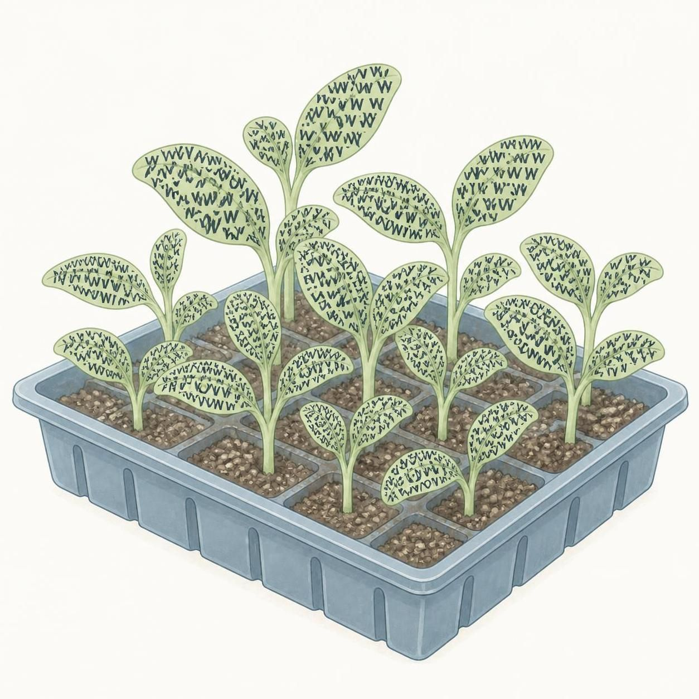

::: {.eyecatch}

:::

# エージェントにも人間にも読める知識バンドルを作る

ドキュメントを **エージェントに読める形で整え、公開する** Quarto テンプレートツールです。

LLM やエージェントに知識を読ませたいのに、検索がズレて回答がハズレる — それは文章が悪いのではなく、**知識が「形式」に沿って整理されていない**からです。

- **Why**: 人間向けの文章のままでは、エージェントは概念の区切り・メタ情報・鮮度を正しく読めない
- **What**: OKF（Open Knowledge Format）は知識を「1 概念 1 ファイル + フロントマター」に構造化する形式
- **How**: `.qmd` を書くだけで、**人間用 HTML** と **機械用 OKF バンドル**、さらに**リンターチェック**までが同時に生まれる

:::{.text-center .mt-4 .mb-4}
[オンラインで試す](editor.qmd){.btn .btn-primary .btn-lg role="button"}
[テンプレートを入手（quarto use template）](#quick-start){.btn .btn-outline-primary .btn-lg role="button"}
[ドキュメントを読む](#まず読んでほしい){.btn .btn-link role="button"}
:::

## まず読んでほしい

OKF や知識バンドルが初めての方は、この順で読んでください。

1. [0. What is OKF](tutorial/00-what-is-okf.qmd) — OKF・バンドル・用語の基礎(10 分)
2. [1. Create a Bundle](tutorial/01-create-bundle.qmd) — 実際に作ってみる
3. [2. Concept Types](tutorial/02-concept-type.qmd) — 6 種の型の書き方
4. [3. Deploy](tutorial/03-deploy.qmd) — 公開する
5. [OKF × RAG Synergy](tutorial/okf-rag.qmd) — なぜエージェントに効くのか

```{mermaid}
flowchart LR
    Q["concepts/*.qmd<br>書く(1 概念 1 ファイル)"] --> L["quarto render"]
    L --> H["_site/<br>人間用 HTML"]
    L --> O["okf/<br>機械用 OKF バンドル"]
    O --> V["validate-okf リンター<br>準拠 + 品質警告"]
```

::: {.callout-tip}
## ブラウザで試す

ローカル環境なしで OKF 概念ファイルを編集・コミットできます。[Online Editor](editor.qmd) または [Quarto Editor PE](https://quarto-editor-pe.vercel.app/editor) を開いてください。
:::

- エージェントにも人間にも読める `.qmd` をソースに
- `quarto use template` 一発でバンドル雛形を生成
- レンダリングで **人間用 HTML** と **機械用 OKF バンドル** を二系統出力
- **リンターツール**として準拠チェック + 鮮度・欠落の品質警告
- GitHub Pages / Cloudflare Pages に並行デプロイ

## OKF バンドルとは

エージェントにも人間にも読める形で、ドキュメント群をひとまとめにした知識パッケージです（知識バンドル = OKF バンドル、以下「OKF バンドル」）。
`okf/` ディレクトリ(index.md / log.md / concepts/*.md)に機械可読な Markdown として自動生成され、
人間向けの HTML と **同じ source(.qmd)** から同時に出力されます。

- **concept 単位で構造化** … API / Playbook / Metric / Attested Computation を 1 ファイル 1 概念で記述
- **frontmatter が辞書** … type・対象・作成日などのメタ情報を機械が解釈
- **sha 差分追跡** … バンドル全体の更新差分を機械が検知できる

## OKF v0.2 と信頼信号

**Open Knowledge Format v0.2** は、Google Cloud が 2026 年 7 月に公開した、AI エージェント間で知識を安全に共有・交換するためのオープン仕様です。v0.1 の「Markdown + YAML frontmatter」という最小構成を継承しつつ、v0.2 では **5 つの trust signal（信頼信号）** を frontmatter に追加しました。

::: {.callout-note}
## 出典

本節の内容は [Google Cloud Blog: "OKF v0.2 adds trust signals"](https://cloud.google.com/blog/products/data-analytics/okf-v0-2-adds-trust-signals) に基づく整理です。
:::

### 2 種類のバンドル

OKF では知識のまとまりを「**知見バンドル**」と「**情報バンドル**」の 2 つに区別します。

- **知見バンドル（Curated Knowledge Bundle）** — 人間やエージェントがキュレートした「知識」の集まり。Concept Documents(.md)＋YAML frontmatter＋Markdown body（Schema / Examples / Citations / Prose）＋`index.md` / `log.md` で構成され、ここが okf-seedling の出力対象です
- **情報バンドル（Information / Data Bundle）** — キュレート前の「生データ」や外部情報源。Wiki / Confluence、BigQuery などの DB スキーマ、API 仕様書、生データ・ログ、ポリシー・標準規格を含みます

```{mermaid}
flowchart LR
    subgraph CURATED["知見バンドル<br>(Curated Knowledge Bundle)"]
        C["concepts/*.md<br>frontmatter + body"]
    end
    subgraph SIGNALS["OKF v0.2 Trust Signals<br>(信頼の層)"]
        S["sources / generated / verified<br>stale_after / status / attested"]
    end
    subgraph RAW["情報バンドル<br>(Information / Data Bundle)"]
        I["Wiki / DB スキーマ<br>API 仕様書 / ログ / 標準規格"]
    end
    C -- "references(参照)" --> I
    S -. "信頼性の証跡" .-> C
```

### 5 つの信頼信号

エージェント（知識の消費者）が知識を採用する前に判断すべき 5 つの問いです。

| # | 問い | frontmatter フィールド |
|---|---|---|
| 1 | 何から作られたか？ | `sources`（出典） |
| 2 | どれだけ信頼できるか？ | `generated` / `verified`（生成者・検証者） |
| 3 | まだ正しいか？ | `stale_after`（鮮度期限） |
| 4 | 現在のバージョンか？ | `status`（draft → stable → deprecated） |
| 5 | 正規の方法で計算されたか？ | Attested Computation（計算証明・レシート） |

### 相関の本質

- 知見バンドルは情報バンドルを **参照（references）** する
- OKF v0.2 の trust signals がその参照に **信頼性の証跡** を与える
- 信頼性は「スコア」ではなく **観測可能な事実** として記録される
- これにより、エージェントは本文を読む前に frontmatter だけで **採用/棄却の判断** ができる

::: {.grid}

::: {.g-col-6 .g-col-md-4 .card}
## Create
`quarto use template watanabe3tipapa/okf-seedling` で新しい知識バンドルを生成。[バンドル生成の手順を見る](tutorial/01-create-bundle.qmd)
:::

::: {.g-col-6 .g-col-md-4 .card}
## Author
6 種の concept 型(API / Playbook / Metric / Attested Computation)を type レジストリで拡張可能。[concept 型ごとの書き方を見る](tutorial/02-concept-type.qmd)
:::

::: {.g-col-6 .g-col-md-4 .card}
## Deploy
GitHub Pages と Cloudflare Pages に並行デプロイ。frontmatter は HTML にも出力され、Playwright による知識蓄積にも対応。[デプロイ手順を見る](tutorial/03-deploy.qmd)
:::

:::

## OKF × RAG Synergy

OKF（Open Knowledge Format）と RAG は競合ではなく、OKF バンドルが RAG の精度を左右する **RAG-ready な知識基盤**になる補完関係です。実バンドル例でシナジーを分解します。[詳細を読む](tutorial/okf-rag.qmd)

## 知識の頭出し(Peek)

カセットテープを再生位置の先頭に戻す「頭出し」のように、**知識のいちばん頭をチラ見する**体験です。「たしかこんな概念があったはず…」といううろ覚えの記憶に、title・description・鮮度チップ・本文の一行がフックして、「ああ、そうだった」から一歩進んだ **新しい気づき** を取りに出します。

OKF バンドルは「1 概念 1 ファイル + frontmatter」なので、概念そのものが頭出しの単位になります。下のカードはこのサイト自身のバンドル(`okf/concepts/*.md`)から `quarto render` 時に自動生成しています。クリックで本文の頭が展開され、詳細ページへ飛べます。

::: {.callout-note}
## 任意の LP にも貼れます

このセクションはテンプレート同梱の `tools/gen-peek.mjs` が生成しており、`quarto use template` 派生のバンドルなら同じ手順で自分の LP に設置できます。[1. Create a Bundle](tutorial/01-create-bundle.qmd#peek-lp) を参照してください。
:::

<div class="peek-controls">
<button id="peek-random" type="button" class="btn btn-outline-primary btn-sm">今日の頭出し</button>
<span id="peek-status" class="peek-status" aria-live="polite"></span>
</div>

<div id="peek-cards" class="peek-grid"></div>
<noscript>
  <div class="callout callout-style-default callout-note callout-titled">
  <div class="callout-header d-flex align-content-center">
  <div class="callout-icon-container"><i class="callout-icon"></i></div>
  <div class="callout-title-container flex-fill"><span class="screen-reader-only">Note</span>Peek カードの表示には JavaScript が必要です</div>
  </div>
  <div class="callout-body-container callout-body">
  <p>バンドルの中身は以下から直接ご覧ください。</p>
  <ul>
    <li><a href="concepts/api-overview.html">API Overview — API 全体の概要（認証・バージョン・エラー）</a></li>
    <li><a href="concepts/api-endpoint.html">API Endpoint — 1 エンドポイントの仕様</a></li>
    <li><a href="concepts/api-schema.html">API Schema — 入出力の型・JSON スキーマ</a></li>
    <li><a href="concepts/playbook.html">Playbook — 手順書・対処手順</a></li>
    <li><a href="concepts/metric.html">Metric — 指標の定義</a></li>
    <li><a href="concepts/attested-computation.html">Attested Computation — 検証可能な計算定義</a></li>
  </ul>
  </div>
  </div>
</noscript>

<!--PEEK_DATA-->

<script>
(function () {
  var dataEl = document.getElementById("peek-data");
  var grid = document.getElementById("peek-cards");
  var btn = document.getElementById("peek-random");
  var statusEl = document.getElementById("peek-status");
  if (!dataEl || !grid) return;

  var items;
  try {
    items = JSON.parse(dataEl.textContent);
  } catch (e) {
    items = [];
  }
  if (!items.length) {
    var p = document.createElement("p");
    p.className = "text-muted";
    p.textContent = "バンドルに概念がありません(concepts/*.qmd を書いて quarto render)。";
    grid.appendChild(p);
    if (btn) btn.style.display = "none";
    return;
  }

  function chipInfo(item) {
    if (!item.staleAfter) return { label: item.status || "-", cls: "peek-chip-neutral" };
    var stale = new Date(item.staleAfter.length === 10 ? item.staleAfter + "T23:59:59" : item.staleAfter);
    var fresh = !isNaN(stale.getTime()) && stale.getTime() >= Date.now();
    return fresh
      ? { label: item.status || "-", cls: "peek-chip-ok" }
      : { label: (item.status || "-") + " / 要更新", cls: "peek-chip-stale" };
  }

  function makeCard(item) {
    var card = document.createElement("div");
    card.className = "peek-card";
    card.dataset.peekId = item.id;
    card.setAttribute("role", "button");
    card.setAttribute("tabindex", "0");
    card.setAttribute("aria-expanded", "false");

    var badge = document.createElement("span");
    badge.className = "peek-badge";
    badge.textContent = item.type || "";
    card.appendChild(badge);

    var chip = document.createElement("span");
    var info = chipInfo(item);
    chip.className = "peek-chip " + info.cls;
    chip.textContent = info.label;
    card.appendChild(chip);

    var title = document.createElement("p");
    title.className = "peek-title";
    title.textContent = item.title || item.id;
    card.appendChild(title);

    var desc = document.createElement("p");
    desc.className = "peek-desc";
    desc.textContent = item.description || "";
    card.appendChild(desc);

    var head = document.createElement("div");
    head.className = "peek-head";
    head.textContent = item.head || "";
    var link = document.createElement("a");
    link.className = "peek-link";
    link.href = item.url;
    link.textContent = "開いて読む →";
    head.appendChild(link);
    card.appendChild(head);

    function toggle() {
      var open = card.classList.toggle("open");
      card.setAttribute("aria-expanded", open ? "true" : "false");
    }
    card.addEventListener("click", function (ev) {
      if (ev.target.closest("a")) return;
      toggle();
    });
    card.addEventListener("keydown", function (ev) {
      if (ev.key === "Enter" || ev.key === " ") {
        ev.preventDefault();
        toggle();
      }
    });
    return card;
  }

  var seen = {};
  items.forEach(function (it) {
    grid.appendChild(makeCard(it));
  });

  if (btn && statusEl) {
    btn.addEventListener("click", function () {
      var pool = items.filter(function (it) { return !seen[it.id]; });
      if (!pool.length) pool = items;
      var pick = pool[Math.floor(Math.random() * pool.length)];
      seen[pick.id] = true;
      var card = grid.querySelector('[data-peek-id="' + pick.id + '"]');
      Array.prototype.forEach.call(grid.querySelectorAll(".peek-card"), function (c) {
        c.classList.remove("peek-spotlight");
      });
      if (card) {
        void card.offsetWidth; // アニメーション再始動
        card.classList.add("open", "peek-spotlight");
        card.setAttribute("aria-expanded", "true");
        card.scrollIntoView({ behavior: "smooth", block: "center" });
      }
      statusEl.textContent =
        "→ " + (pick.title || pick.id) + "(" + (pick.type || "") + ") " +
        Object.keys(seen).length + "/" + items.length;
      if (Object.keys(seen).length === items.length) {
        statusEl.textContent += " — 全概念を頭出ししました";
      }
    });
  }
})();
</script>

## Concept 型

| Type | 説明 | 選び方の目安 |
|------|------|------|
| [API Overview](concepts/api-overview.qmd) | API 全体の概要（認証・バージョン・エラー） | API の設計方針や全体像を説明したい（ここから読むのがおすすめ） |
| [API Endpoint](concepts/api-endpoint.qmd) | 1 エンドポイントの仕様 | 「GET /users」のような個別の API を 1 本ずつ定義したい |
| [API Schema](concepts/api-schema.qmd) | 入出力の型・JSON スキーマ | リクエスト/レスポンスの形を正確に機械へ伝えたい |
| [Playbook](concepts/playbook.qmd) | 手順書・対処手順 | 「エラーが起きたらどうするか」のような手順を構造化したい |
| [Metric](concepts/metric.qmd) | 指標の定義 | 計測値の定義・単元・鮮度を機械に解釈させたい |
| [Attested Computation](concepts/attested-computation.qmd) | 検証可能な計算定義 | 計算ロジックを再実行可能な形で記録したい |

## Quick Start

最低限の手順でローカルにバンドルを作って検証します。前提条件は **Quarto**（≥ 1.4）と **Node.js**（≥ 18）のインストールです（[Quarto 公式サイト](https://quarto.org/docs/get-started/) を参照）。

::: {.text-center .mb-3}
ブラウザで試すなら、[Online Editor で始める](editor.qmd){.btn .btn-primary .btn-lg role="button"}
:::

**Step 1.** テンプレートから雛形を生成します

```bash
quarto use template watanabe3tipapa/okf-seedling
```

**Step 2.** 人間用 HTML と OKF バンドルを同時にレンダリングします

```bash
quarto render
```

**Step 3.** 準拠チェック + 品質警告を実行します

```bash
node tools/validate-okf.mjs
```
